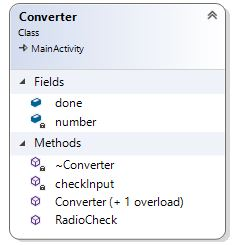
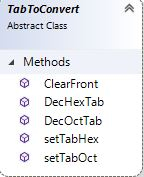
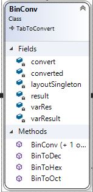
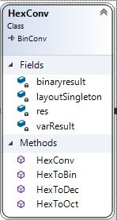
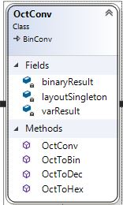
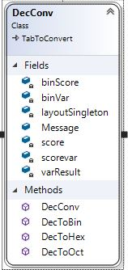
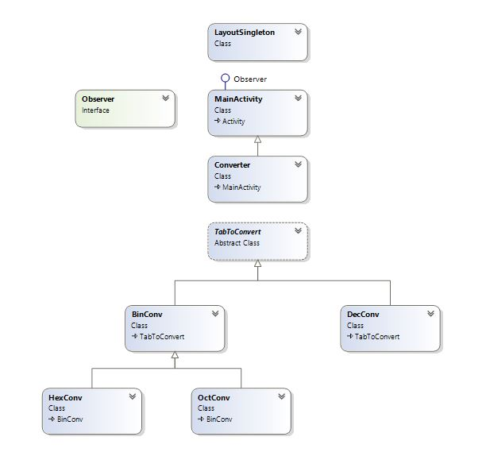

## Numerical System Converter
# Dokumtacja

<b>
Spis Treści: 
1. Lista oznaczeń 
2. Wstęp 
3. Wymagania systemowe 
4. Funkcjonalność 
5. Analiza problemu 
6. Projekt techniczny  
7. Opis realizacji 
8. Opis wykonanych testów 
9. Podręcznik użytkownika 
</b>

<b>1. Lista oznaczeń</b>

BIN - system binarny(2) 
OCT - system ósemkowy(8) 
DEC - system dziesiętny(10) 
HEX - system szesnastkowy(16) 

<b>2. Wstęp</b>

Aplikacja moblina na systemy Android obliczająca wartość liczby z zadanego systemu liczbowego (BIN, OCT, DEC, HEX) na pozostałe systemy. Aplikacja jest zarówno polsko jak i angielskojęzyczna. 

<b>3. Wymagania systemowe</b> 
- smartfon z systemem Android w wersji 4.4 lub wyższej
- 10 MB wolnego miejsca w pamięci wewnętrznej/zewnętrznej telefonu

<b> 4.Funkcjonalność</b>

- obliczanie liczby zadanej w określonym formacie na pozostałe systemy dostępne w ramach aplikacji
- możliwość zmiany języku PL/EN

<b> 5.Analiza problemu </b>

W systemach liczbowych znaczenie ma wartość cyfry oraz jej indeks w liczbie.

Dla systemu dwójkowego mamy do dyspozycji 2 cyfry {0,1}. Każda następna cyfra (licząc od końca) w liczbie jest 2 razy większa od cyfry rzędu poprzedniego. 

W ten sposób możemy stworzyć uogulniony schemat opisu systemu N.

Dla systemu N mamy do dyspozycji N cyfr z przedziału <0,N-1>. Każda następna cyfra (licząc od końca) w liczbie jest N razy większa od cyfry poprzedniego rzędu.

Zamiana systemów - schematy zastosowane w aplikacji 
a)bin->oct 
 
b)bin->dec
 Otrzymaną liczbę w typie double zamieniamy na tablicę charów. Następnie obracamy tablicę i od końca tablicy zaczynamy mnożyć cyfry z systemu binarnego razy kolejne potęgi liczby 2 jednocześnie dzieląc modulo naszą pierwotną liczbę.
 
c)bin->hex

d)oct->bin

g)dec->bin

h)dec->oct

i)dec->hex

j)hex->bin

j)hex->dec

<b>6.Projekt techniczny</b> 
6.1 LayoutSingleton - tworzy pola użyte w pliku layoutowym XAML, które będą istnieć przez cały czas życia aplikacji. Wykorzystano do tego design pattern - Singleton 

 

6.2 Main Activity - tworzy obiekt klasy LayoutSingleton, przypisuje mu istniejące w GUI elementy. Dodatkowo zajmuje się obsługą Eventów buttona oraz switcha. Pole ErrorText przechowuje tekst, który jest wyświetlany w przypadku błędnej konwersji. 

Metody:

-convertNumber: 

IN: przekazuje pola ulegające zmianie w GUI oraz wpisaną przez użytkownika liczbę. 

OUT: w przypadku poprawnej konwersji zwraca true, w przeciwnym razie false.

Dodatkowo klasa Main Activity dziedziczy po interfejsie Observer, który implementuje metodę UpdateLanguage wywoływaną wraz ze zmianą switcha. Jest to przykładowy sposób użycia wzorca projektowego Observer. 

6.3 Converter  

Metody: 

-RadioCheck: tworzy obiekty klas odpowiedzialnych za konwersję w zależoności od zaznaczonego RadioButton

	IN: LayoutSingleton

	OUT: bool - true gdy konwersja przebiegła pomyślnie

-checkInput: sprawdza, czy numer został wprowadzony poprawnie

	IN: możliwości wyboru w zależności od systemu

	OUT: bool - true gdy numer wpisany poprawnie. 
	

6.4 TabToConvert 

Metody :

-setTabHex - dla 4 cyfr binarnych ustawia odpowiednik w HEX

	IN: liczba binarna(string)
	OUT: wynik w HEX(string) 

-setTabOct - dla 3 cyfr binarnych ustawia odpowiednik w OCT

	IN: liczba binarna(string)
	OUT: wynik w OCT(string) 
-DecHexTab - na podstawie liczby dziesiętnej otrzymujemy wynik w HEX

-DecOctTab - na podstawie liczby dziesiętnej otrzymujemy wynik w OCT

-ClearFront - usuwa '0' z przodu, metoda kosmetyczna

	IN: tekst, który ma zostać edytowany

	OUT: zedytowany tekst.
	
	
 

6.4 Bin Conv - każda z metod przyjmuje liczbę wpisaną przez użytkownika(string) oraz zwraca przekonwertowaną(string 

Metody:
- BinToDec - konwersja Bin->Dec
- BinToOct - konwersja Bin->Oct, wykorzystuje metodę setTabOct
- BinToHex - konwersja Bin->Hex, wykorzystuje metodę setTabHex 

 

6.5 HexConv 

Metody:
- HexToBin - dla każdej cyfry w liczbie HEX przypisuje kolejno jej odpowienik 4-cyfrowej liczby binarnie.

	OUT: liczba BIN (string)
	
- HexToDec - na podstawie cyfry w liczbie HEX tworzy liczbę dziesiętną zgodnie ze schematem przedstawionym w punkcie 5.

	OUT: liczba DEC(string) 
- HexToOct - wykorzystuje przekonwertowaną liczbę binarnie i wykorzystuje metodę z BinConv
	OUT: liczba OCT(string)

 

6.6 OctConv 
Metody:
- OctToBin - dla każdej cyfry w liczbie wprowadzonej przez użytkownika tworzy jej 3 cyfrowy binarny odpowiednik

	OUT: liczba BIN(string)
- OctToDec - wykorzystuje przekonwertowaną liczbę binarnie i wykorzystuje metodę z BinConv

	OUT: liczba DEC(string)
- OctToHex - wykorzystuje przekonwertowaną liczbę binarnie i wykorzystuje metodę z BinConv

	OUT: liczba HEX(string)

 

6.7 DecConv 
Metody:
- DecToBin - metoda realizuje funkcję opisaną w punkcie 5-tym dla tej konwersji.
OUT: liczba BIN(string)
- DecToOct -metoda realizuje funkcję opisaną w punkcie 5-tym dla tej konwersji.
OUT: liczba OCT(string)
- DecToHex - metoda realizuje funkcję opisaną w punkcie 5-tym dla tej konwersji.
OUT: liczba HEX(string)

 

UML całości:  
 

<b>7.Opis realizacji</b>

Projekt był tworzony w środowisku Visual Studio 2017 Enterprise.

Aplikacja testowana była na smartfonach:
- Sony Xperia XZ Premium (Android 8.0)
- Sony Xperia Z3 Compact (Android 4.4.4)
- Samsung Galaxy S6 (Android 5.0)

<b>8.Opis wykonanych testów </b> 
Testy były wykonywane wraz z kolejnymi funckjonalnościami. Sprawdzana była poprawność obliczeń oraz zakres, dla którego konwersja przebiegała poprawnie.

<b>9.Podręcznik użytkownika </b>

- instalacja aplikacji
- uruchomienie aplikacji
- wybranie języka oraz systemu, w którym chce się wpisać liczbę
- wpisanie liczby w wskazane miejsce
- potwierdzenie przyciskiem "Oblicz/Count"

W razie problemów z instalacją/funkcjonalnością aplikacji prosżę o kontakt mailowy: szymonbortel8@gmail.com. W temacie maila proszę zawrzeć "GIT_NSC". 

