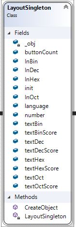
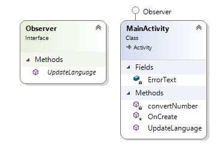

## Numerical System Converter
# Dokumtacja

<b>
Spis Treści: 
1. Lista oznaczeń 
2. Wstęp 
3. Wymagania systemowe 
4. Funkcjonalność 
5. Analiza problemu 
6. Projekt techniczny  
7. Opis realizacji 
8. Opis wykonanych testów 
9. Podręcznik użytkownika 
</b>

<b>1. Lista oznaczeń</b>

BIN - 
OCT - 
DEC - 
HEX - 

<b>2. Wstęp</b>

Aplikacja moblina na systemy Android obliczająca wartość liczby z zadanego systemu liczbowego (BIN, OCT, DEC, HEX) na pozostałe systemy. Aplikacja jest zarówno polsko jak i angielskojęzyczna. 

<b>3. Wymagania systemowe</b> 
- smartfon z systemem Android w wersji 4.4 lub wyższej
- 10 MB wolnego miejsca w pamięci wewnętrznej/zewnętrznej telefonu

<b> 4.Funkcjonalność</b>

- obliczanie liczby zadanej w określonym formacie na pozostałe systemy dostępne w ramach aplikacji
- możliwość zmiany języku PL/EN

<b> 5.Analiza problemu </b>

W systemach liczbowych znaczenie ma wartość cyfry oraz jej indeks w liczbie.

Dla systemu dwójkowego mamy do dyspozycji 2 cyfry {0,1}. Każda następna cyfra (licząc od końca) w liczbie jest 2 razy większa od cyfry rzędu poprzedniego. 

W ten sposób możemy stworzyć uogulniony schemat opisu systemu N.

Dla systemu N mamy do dyspozycji N cyfr z przedziału <0,N-1>. Każda następna cyfra (licząc od końca) w liczbie jest N razy większa od cyfry poprzedniego rzędu.

Zamiana systemów:
a)bin->oct
b)bin->dec
c)bin->hex
d)oct->bin
e)oct->dec
f)oct->hex
g)dec->bin
h)dec->oct
i)dec->hex
j)hex->bin
k)hex->oct
j)hex->dec

<b>6.Projekt techniczny</b>
6.1 LayoutSingleton - tworzy pola użyte w pliku layoutowym XAML, które będą istnieć przez cały czas życia aplikacji. Wykorzystano do tego design pattern - Singleton 

6.2 Main Activity - tworzy obiekt klasy LayoutSingleton, przypisuje mu istniejące w GUI elementy. Dodatkowo zajmuje się obsługą Eventów buttona oraz switcha. Pole ErrorText przechowuje tekst, który jest wyświetlany w przypadku błędnej konwersji.
Metody:
convertNumber: IN: przekazuje pola ulegające zmianie w GUI oraz wpisaną przez użytkownika liczbę. 
OUT: w przypadku poprawnej konwersji zwraca true, w przeciwnym razie false.

Dodatkowo klasa Main Activity dziedziczy po interfejsie Observer, który implementuje metodę UpdateLanguage wywoływaną wraz ze zmianą switcha. Jest to przykładowy sposób użycia wzorca projektowego Observer.

[diagramy UML]

[diagram klas]

Parę Uwag Wstępnych

Równie istotna jest strona edycyjna utworzonego dokumentu (data utworzenia i kolejnych modyfikacji, nazwisko osoby oraz e-mail kontaktowy, copyrights, nazwa projektu, itd.)

W przypadku dużych projektów, każdy z wyżej wymienionych rozdziałów może być realizowany w postaci oddzielnego dokumentu.

Kod źródłowy rzadko umieszcza się w dokumentacji gdyż ulega on częstym zmianom. Nie oznacza to jednak, że kod źródłowy jest zupełnie nieopisany. Wręcz przeciwnie - kod źródłowy powinien dokumentować się sam, tzn. odpowiednie jego fragmenty powinny być uzupełnione treściwym, ale zwięzłym, komentarzem. W zależności od fragmentu kodu przypisany mu komentarz powinien przede wszystkim opisywać główną ideę, cel lub też specyfikę tego fragmentu kodu. W razie konieczności można automatycznie wygenerować dokumentację z opisem fragmentów kodu na podstawie jego struktury oraz zawartych tam komentarzy. Istnieje kilka narzędzi do tego celu, np. Doxygen […]. 

Poniżej przedstawiany przykładowe fragmenty funkcji wraz z przyjętym w naszych projektach formatem ich komentowania.

 
///////////////////////////////////////////////////////////
// This function does k-means on the input image.
///////////////////////////////////////////////////////////
//		
// INPUT:
//		tu opisujemy argumenty funkcji, ich typ i role
//		
// OUTPUT:
//		tu opisujemy co zwraca dana funkcja
//		
// REMARKS:
//		tutaj zapisujemy dodatkowe uwagi, np. dodatkowe
//		opcje wywołań, specjalny format argumentów, itd.
//		

Powyższy opis użyty w pewny fragmencie rzeczywistego projektu

 
///////////////////////////////////////////////////////////
// This function does k-means on the input image.
///////////////////////////////////////////////////////////
//		
// INPUT:
//		inImage - a color image
//		initialMeans - external table of the initial means
//		outMeanCenters - optional repository for output of final
//			k means
//		maxAllowableIteration - a fuse for max number of iterations
//		madeIterations - optional parameter for actual number
//			of iterations
//		
// OUTPUT:
//		status of the operation (see k_Means_Message)
//		
// REMARKS:
//		
//		
k_Means_Message k_MeansForImage::operator () ( 	const ColorImage & inImage, 
								const DataRepository & initialMeans, 
								ColorImage * & outImage, 
								int maxAllowableIteration /*= 1000*/ );
 

Podobnie dla klas, dla przykładu

 
///////////////////////////////////////////////////////////
// This class implements my vision of eye recognition.
///////////////////////////////////////////////////////////
class TEyeRecognition
 
 
 6.1
 Przykład - Main Class Hierarchy

Video streams are composed of strictly timed image frames. Rysunek 41 depicts class hierarchy for this video data structure. Data organization of a video object is presented in …. 

Rysunek 41. TVideoFor<> class hierarchy

The template class TVideoFor<> contains a vector of pointers to the frame images. Each frame is an object of the TImageFor<> class. 

<b>7.Opis realizacji</b>

Projekt był tworzony w środowisku Visual Studio 2017 Enterprise.

Aplikacja testowana była na smartfonach:
- Sony Xperia XZ Premium (Android 8.0)
- Sony Xperia Z3 Compact (Android 4.4.4)
- Samsung Galaxy S6 (Android 5.0)

<b>8.Opis wykonanych testów </b> 
Testy były wykonywane wraz z kolejnymi funckjonalnościami. Sprawdzana była poprawność obliczeń oraz zakres, dla którego konwersja przebiegała poprawnie.

Ogarniczenia liczbowe dla systemów:
binarny:
ósemkowy:
dziesiętny:
szesnastkowy:

<b>9.Podręcznik użytkownika </b>

- instalacja aplikacji
- uruchomienie aplikacji
- wybranie języka oraz systemu, w którym chce się wpisać liczbę
- wpisanie liczby w wskazane miejsce
- potwierdzenie przyciskiem "Oblicz/Count"

W razie problemów z instalacją/funkcjonalnością aplikacji prosżę o kontakt mailowy: szymonbortel8@gmail.com. W temacie maila proszę zawrzeć "GIT_NSC". 

